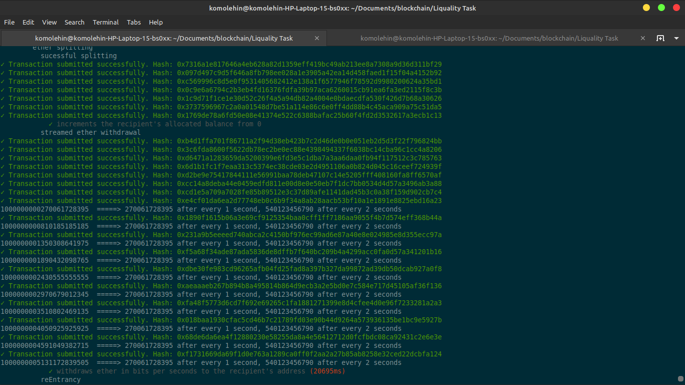

## A test driven smart contract to split Ether and ERC20 tokens to a list of recipients and to simulate money stream during withdrawal

* I paid the gas fee using another recipient so as not to tamper with the withdrawal balance update after paying gas fee
* Recipient default balance was 100 ETH
* This makes it easier to test that the withdrawal amount is in the correct proportion
* I simulated the money stream by causing `1 second` delay before every withdrawal in the test script however it took `2 seconds` to complete withdrawal
* This means that I made withdrawal every `1 second` but it took `2 seconds` for the transaction to be processed, hence withdrawing at `2 seconds` interval
* The withdraw log is present below the README.md. Each withdrawal is at `2 seconds` interval
* Defence against reEntrancy attack weas implemented for ether withdrawal. Test for this was successsful
* My test values are from the PDF sent so it could be easy to see how well the code works

### Unit test displaying the streamed ether withdrawal

### Unit test displaying the streamed erc20 withdrawal

